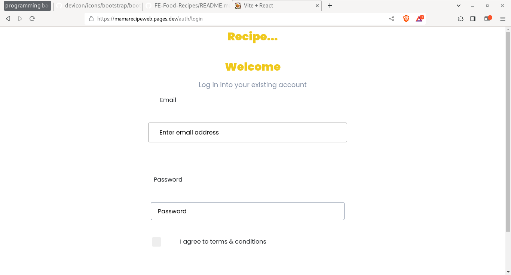
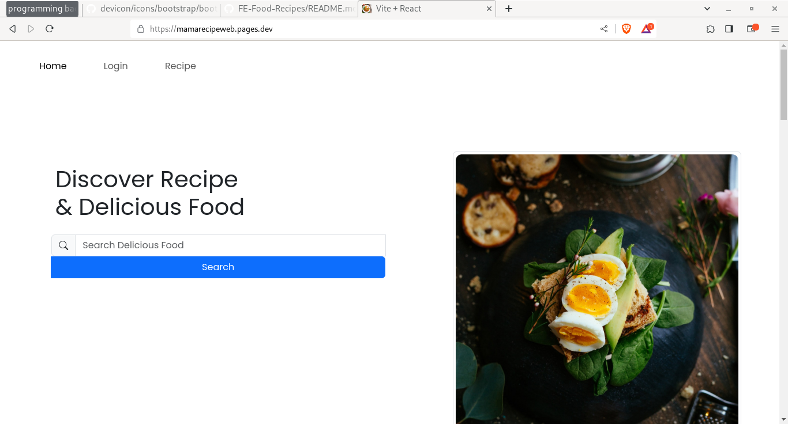
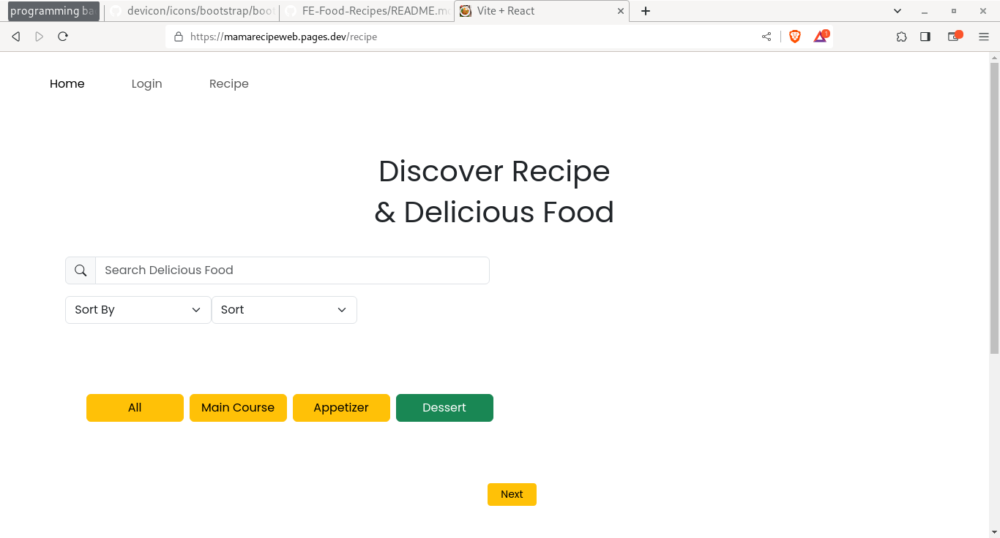
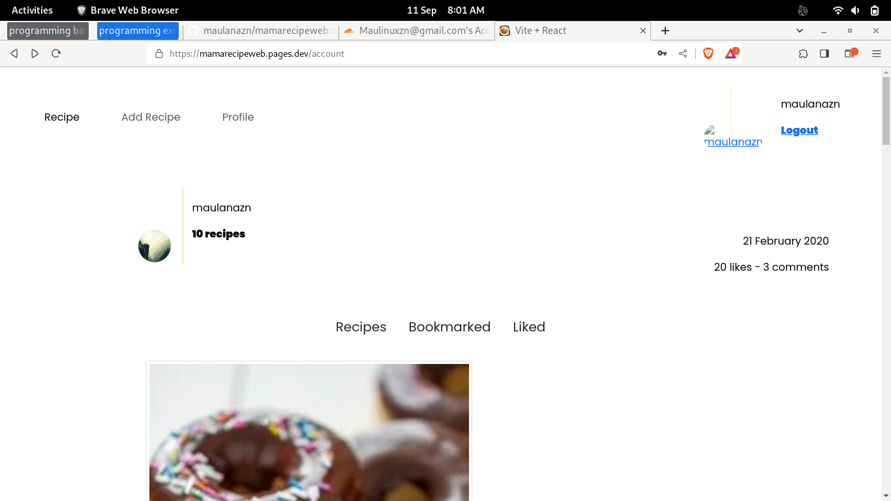

<div align="center">
    <h1>Mama Recipe</h1>
    <image src="https://github.com/maulanazn/RecipeMobileV1/blob/main/src/assets/pijarfoodbootsplash.png" width="230">
    <p>Part of <a href="https://github.com/maulanazn/recipewebdesign">recipe web design</a>. Dynamic data flow and other feature like </p>
</div>

---

<div align="center">
    This part built with some common technology, such as:
    <ul>
        <li><a href="https://nodejs.org/en"></a></li>
        <li><a href="https://www.postgresql.org/"></a></li>
        <li><a href="https://expressjs.com/"></a></li>
    </ul>
    And other library, such as Cloudinary, Morgan, etc. You can view it in my package.json file, don't be lazy to read
</div>

## Prerequisite:
- Computer
- Internet
- NodeJS
- PostgreSQL

## Installation:
1. Clone the project 
```sh
    git clone https://github.com/maulanazn/recipebe
```
2. Install the packages 
```sh
    npm install
```
3. Copy .env.example and paste it as .env file, then Configurate it as Linus and MacOS like:
```sh
    cd Project/ && cp .env.example .env
```
4. Copy .env.example and paste it as .env file, then Configurate it as windows like:
```sh
    copy and paste like you did everyday
```
5. Run hot with:
```sh
    npm run hot --> node index.js --watch
```
6. Run start with:
```sh
    npm start --> node index.js
```

## Contributing

Contributions are what make the open source community such an amazing place to be learn, inspire, and create. Any contributions you make are **greatly appreciated**.

1. Fork the Project
2. Create your Feature Branch (`git checkout -b <username>/<feature-details>`)
3. Commit your Changes (`git commit -m 'Add some AmazingFeature'`)
4. Push to the Branch (`git push origin yourbranch`)
5. Open a Pull Request

## ScreenShot

| image    |    page    |
|----------|------------|
|  | Login | 
|  | HomePage |
|  | All Recipe | 
|  | User Homepage Recipe | 

## Related Project
* [`Mama Recipes Demo`](https://mamarecipeweb.pages.dev/)
* [`Mama Recipes Rest API`](https://stormy-bass-cloak.cyclic.cloud/)
* [`Mama Recipes Frontend Repository`](https://github.com/maulanazn/mamarecipeweb)

## Notes:
### For all of you, if you want to register, please use your gmail account. Because it will automatically sended into your gmail account. You don't have to write the password correctly, at least the email is exist, it's fine.